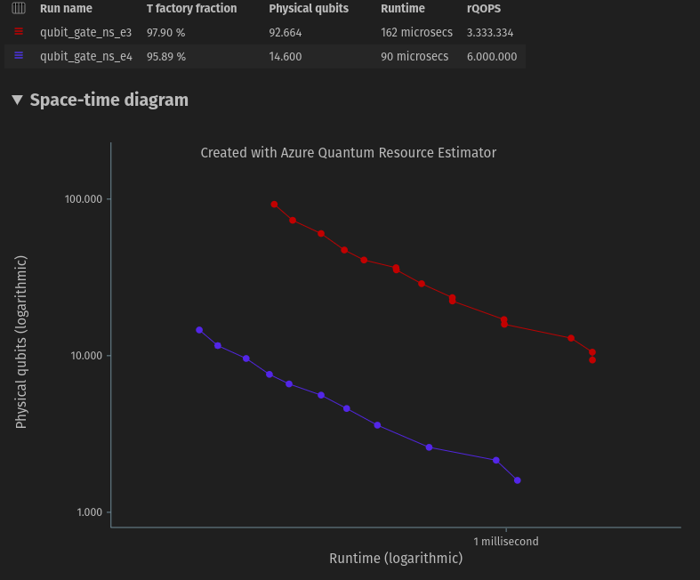
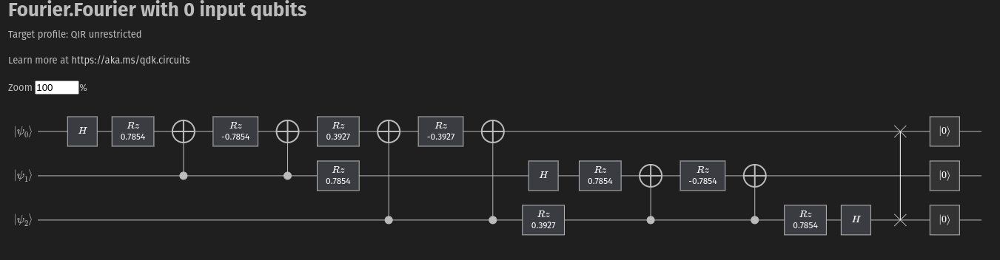

## Estudos em computação Quântica utilizando Q# e Qiskit

# Aplicação de Trânsformada de Fourier Quântica 

Gráfico com velocidade de 0,001 ms 

Circuito Quântico com Porta de Hadamard para os 3 Qubits

